# Addendum to the Shared Experience Guide

Some time ago I put together a guide on [shared experience](https://www.reddit.com/r/Pathfinder_Kingmaker/comments/1jv6ejo/deep_dive_the_shared_experience_setting/?utm_source=share&utm_medium=web2x&utm_name=web2xcss&utm_term=1&utm_content=share_button).

In that guide I examined how increasing level requirements affect progression when comparing reduced party sizes with a full party in an experience system such as Pathfinder: Wrath of the Righteous (WotR).

To illustrate this, I constructed a simplified hypothetical system based loosely on WotR.

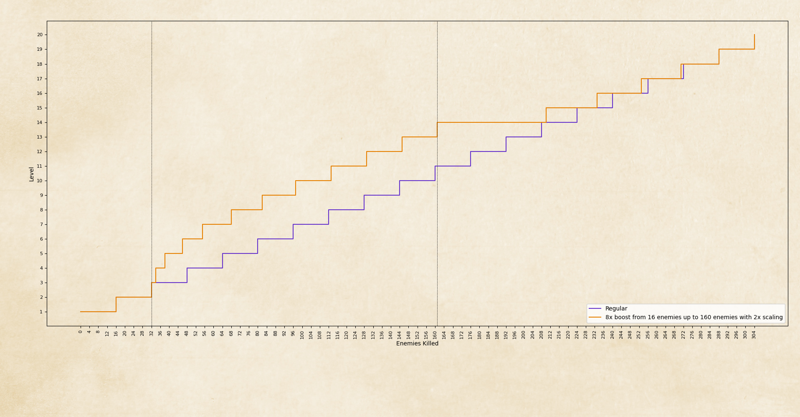

The main finding was that reducing party size accelerates levelling at first, but the advantage stabilises at a fixed number of levels ahead of a standard six-member party. In the simplified system I used, this stabilised at three levels. Once the party size returns to six, the earlier advantage quickly diminishes.

It is important to stress that this model was not WotR itself. The general trends are comparable, but the exact numbers differ. I deliberately chose different level thresholds and different XP multipliers to avoid creating the false impression that the model accurately reproduces WotR’s system.

Why was I not confident enough to build a closer approximation to WotR? The short answer is that I believed doing so satisfactorily would require in-game data collection. 

## WotR Level Requirements

One might reasonably ask: why not simply use WotR’s own level thresholds as the basis for the model? After all, those numbers are known.

Here are the actual level requirements:

| Level | XP        |
| ----- | --------- |
| 1     | 0         |
| 2     | 2,000     |
| 3     | 5,000     |
| 4     | 9,000     |
| 5     | 15,000    |
| 6     | 23,000    |
| 7     | 35,000    |
| 8     | 51,000    |
| 9     | 75,000    |
| 10    | 105,000   |
| 11    | 155,000   |
| 12    | 220,000   |
| 13    | 315,000   |
| 14    | 445,000   |
| 15    | 635,000   |
| 16    | 890,000   |
| 17    | 1,300,000 |
| 18    | 1,800,000 |
| 19    | 2,550,000 |
| 20    | 3,600,000 |

At first glance this seems straightforward. For example: if a full six-character party reaches level 3 at 5,000 XP, then under reduced-party rules a solo character at the same point in the game would have received 30,000 XP, which places them between levels 6 and 7.

We can then graph this. The X-axis would show total XP earned with the setting OFF; the Y-axis would show the matching XP amounts for a (solo) character with the setting ON.

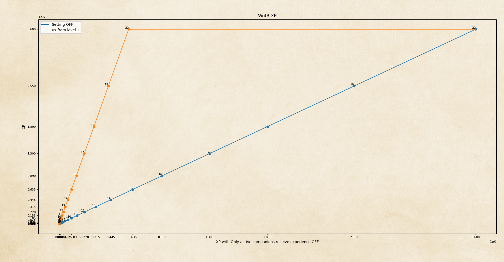

With the axes adjusted to a logarithmic scale with shift so that levels are evenly spaced, the leveling progression becomes clearer.

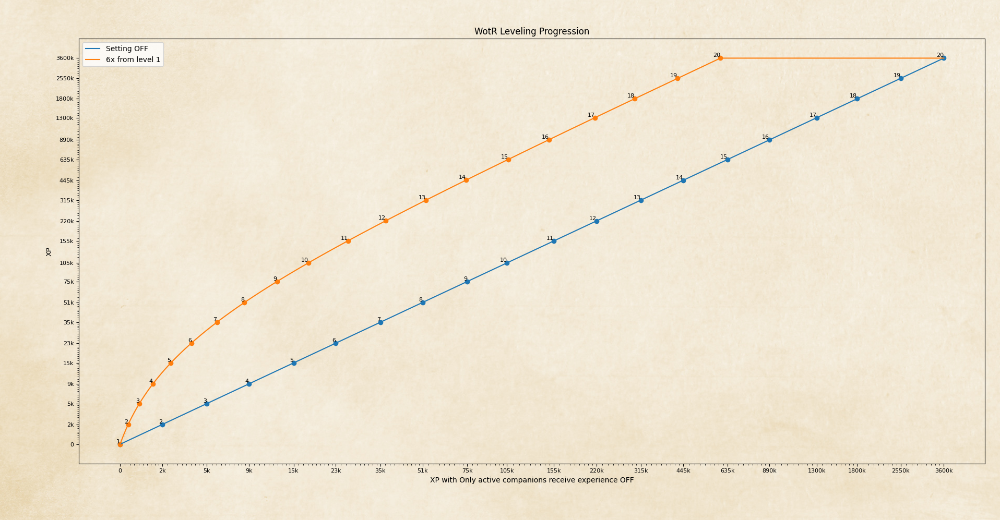  

We can also visualise starting as a solo character at different levels.

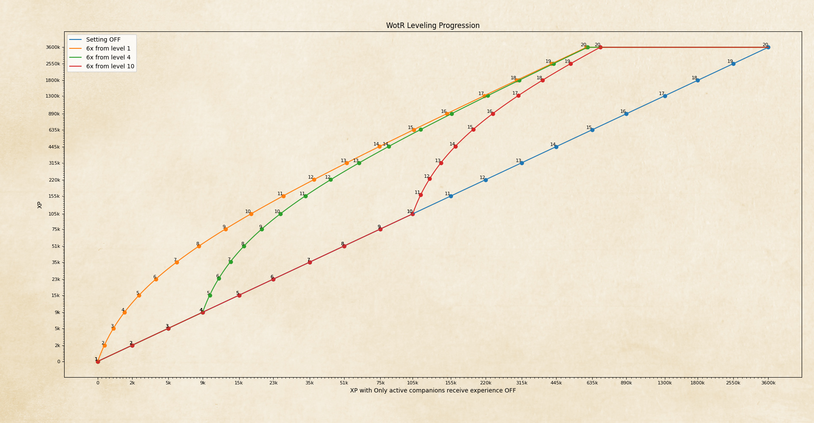   

As well as the effect of returning to a full party after having advanced a certain amount of levels solo.

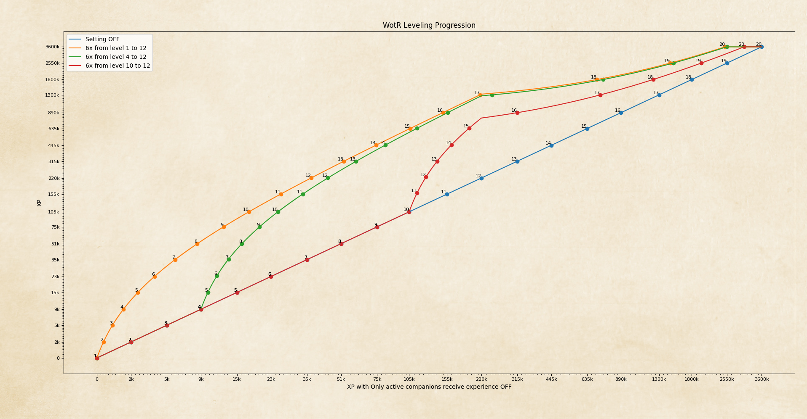  

The overall pattern resembles that of the earlier hypothetical model, though in WotR the stablisation happens at five levels ahead rather than three.

## Why this approach is potentially problematic

Several circumstances override the “only active companions receive XP” setting, nor can we always remain solo.

### Prologue 

In the prologue companion recruitment is forced, and party composition cannot be changed until Defender’s Heart in Act I. Certain characters, such as Camellia and Seelah, cannot be removed or killed without triggering a game over until after leaving Neatholm. Lann or Wenduag cannot be killed until leaving Shield Maze. 

### Hub areas

I define “Hubs” as locations where companions exist as interactable NPCs rather than party members. The player character moves independently, speaks to NPCs, and engages in no combat. Examples include Defender’s Heart in Act I, the Crusader’s Camp in Act II, and Drezen in Act III. Heaven’s Edge in Act II, despite being a quest location, also fits this definition.

In hubs, XP distribution is always treated as though “only active companions receive XP” is OFF. The game ignores the setting, the number of companions, and the party configuration upon entering or leaving the hub in the calculation. All XP is spread evenly across the full roster.

### Companion quests

Many companion-specific quests force the presence of the relevant companion in the party. Often, the associated areas are locked if the companion is not present. 
Attempting to kill the required companion after entering results in an immediate game over.

Some exceptions exist, such as the Nameless Ruins, which can be cleared for the majority of the XP before recruiting Nenio. Bringing her later to progress the quest grants only a trivial amount of XP. 

### Net effect

The magnitude of these exceptions was uncertain to me without systematically recording in-game XP values. Because of this, I did not dare assume that the impact was negligible. 

## Recording XP values for better approximate Graphs

This time I did go into the game and record XP values directly. Using those figures, I will construct an approximate progression graph and then assess how these interruptions influence the reduced-party levelling curve. While the data will still not be precise and covers only one order of play, it should also give a sense of actual level advantage in reduced party play.

### Companion recruitment and loss

The following values are taken from a run with **“Only active companions receive experience”** turned **OFF** and **increased enemies** enabled.
The run was carried out in a straightforward sequence from the Prologue through to the defeat of Nulkineth.

The Underground Hideout and Shallow Grave locations were left unvisited (the assumption being that these would normally be completed after Nulkineth).

All other optional bosses were defeated, and quests were completed in a generally neutral manner, keeping as many options open as possible.

Hardest encounters were delayed if possible.

The Last Sarkorians (DLC) and Visitors from Morta (free DLC) quests in Act II were included.

XP values beyond Neatholm are partly approximated.

Note that XP values will vary between runs, even when content is completed in the same order.

| ±/E | Companion/Event      | XP    | Notes                                                          |
| --- | -------------------- | ----- | -------------------------------------------------------------- |
| +   | Seelah               | 173   |                                                                |
| +   | Camellia             | 298   |                                                                |
| +   | Lann and Wenduag     | 861   |                                                                |
| –   | Lann or Wenduag      | 2275  |                                                                |
| E   | Leave Neatholm       | 2275  | Seelah and Camellia can be killed off without game over        |
| E   | Leave Shield Maze    | 4000  | Mongrels can be killed off without game over                   |
| +   | Woljif               | 6020  |                                                                |
| +   | Ember                | 8600  |                                                                |
| +   | Nenio                | 12600 |                                                                |
| +   | Daeran               | 13100 |                                                                |
| +   | Ulbrig               | 15100 |                                                                |
| E   | Gray Garrison attack | 20100 | Ember, Daeran, and Ulbrig can be delayed until here |
| +   | Sosiel               | 29100 |                                                                |
| +   | Regill               | 43200 |                                                                |
| –   | Regill/Sosiel/Lann   | 43200 | Loss tied to the Leper’s Smile story sequence                  |
| +   | Regill/Sosiel/Lann   | 45500 | Rejoin after Vescavor Queen defeat                             |
| –   | All                  | 53300 | Strike from the Sky event                                      |
| +   | Lann or Wenduag      | 53500 |                                                                |
| +   | Camellia and Seelah  | 53600 |                                                                |
| +   | Ulbrig               | 53900 |                                                                |
| +   | Nenio                | 54400 |                                                                |
| +   | Daeran and Ember     | 54700 |                                                                |
| +   | Sosiel               | 55600 |                                                                |
| +   | Regill               | 56100 |                                                                |
| E   | Nulkineth defeat     | 62800 | Run ended here, no data recorded beyond this point             |

### Companion quests and hub locations

The same run also provides a reference for XP values at points where **Hub** areas are entered or exited, as well as for locations tied to companion quests. These represent further interruptions to consistent reduced-party XP progression.

**CQL** marks companion quest locations that require the relevant character in the party.

| Type | Location               | Stage | Notes                                      | XP    |
| ---- | ---------------------- | ----- | ------------------------------------------ | ----- |
| Hub  | Defender’s Heart       | Enter | First hub after prologue, large initial reward, various dialogues etc.    | 4870  |
|      |                        | Leave |                                            | 6020  |
| CQL  | Thiefling Hideout and the Shop | Enter | “Stolen Moon” with Woljif                  | 6020  |
|      |                        | Leave |                                            | 6250  |
| Hub  | Defender’s Heart       | Enter | Completing Stolen Moon            | 6250  |
|      |                        | Leave |                                            | 6430  |
| Hub  | Defender’s Heart       | Enter | “Spies in Our Midst” completed             | 7400  |
|      |                        | Leave |                                            | 7860  |
| Hub  | Defender’s Heart       | Enter | Storyteller and various NPC events         | 14100 |
|      |                        | Leave |                                            | 15100 |
| Hub  | Defender’s Heart       | Enter | Completing “Stay of Execution”                  | 16000 |
|      |                        | Leave |                                            | 16690 |
| CQL  | Gwerm’s Mansion        | Enter | “Gwerm Family Secrets” with Camellia       | 16700 |
|      |                        | Leave |                                            | 17900 |
| Hub  | Crusader’s Camp        | Enter | Act I reward, Queen, Liotr, other events   | 27700 |
|      |                        | Leave |                                            | 29100 |
| CQL  | Zacharius’s Cemetery   | Enter | “A Farewell” with Sosiel                   | 29100 |
|      |                        | Leave |                                            | 32400 |
| CQL  | Houndheart Campsite    | Enter | “League of the Inspiring Cart” with Seelah | 32400 |
|      |                        | Leave |                                            | 33100 |
| Hub  | Crusader’s Camp        | Enter | Completing Inspiring Cart                       | 33100 |
|      |                        | Leave |                                            | 33500 |
| Hub  | Heaven’s Edge          | Enter | “While the World Burns” with Daeran        | 47900 |
|      |                        | Leave |                                            | 49300 |
| CQL  | Currantglen            | Enter | “Call of Memory” with Ulbrig               | 49300 |
|      |                        | Leave |                                            | 53300 |

### Creating a More Accurate Approximation

We can now combine the recorded in-game XP values with the WotR level requirement table to produce a more accurate approximation graph.

There are, however, still several issues. These interruptions depend on following a particular order of quests and recruitments, while players are free to proceed differently. The “optimal” order also varies depending on build. 

Even when the same sequence is followed, XP values will differ slightly due to random events such as ambushes, which grant minor XP through enemies killed.

### Full-Party Run 

Let us begin with a graph representing a full-party playthrough where the *“Only active companions receive experience”* setting is enabled only when the party has fewer than six members.

This affects mainly the early part of the game and a brief stretch around the “Strike from the Sky” event.

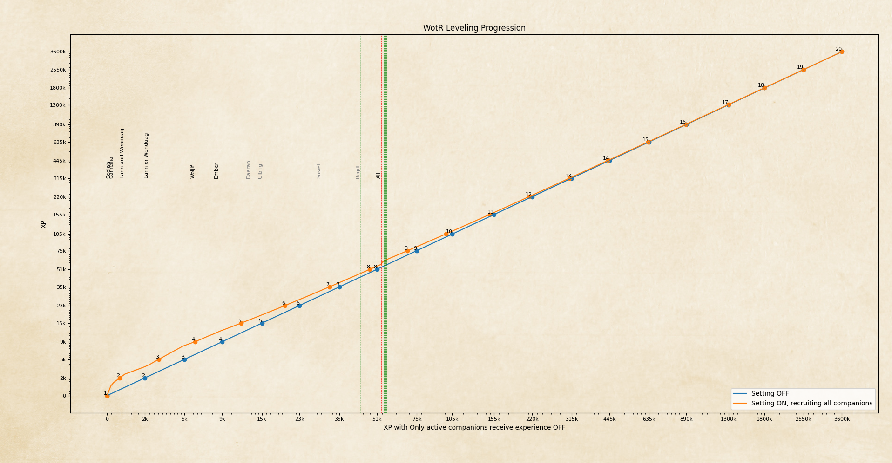

Zooming in on the relevant section, I have also marked the points where hub areas are entered and exited up to the point of reaching six party members. Adjustments beyond that stage are unnecessary since XP gain is the same in and out of hub.

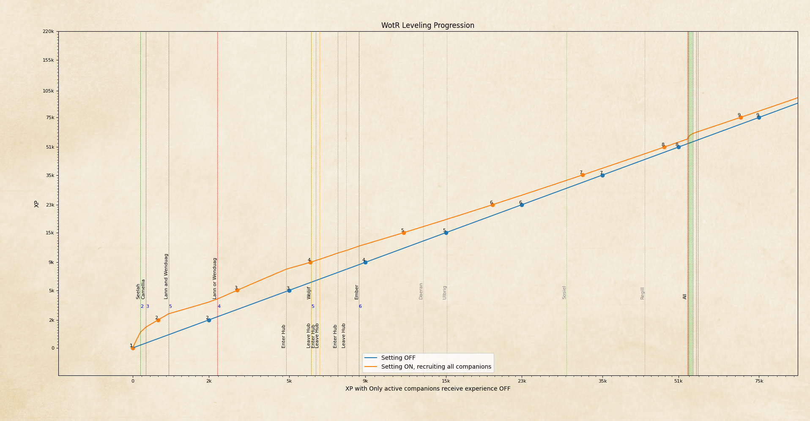

If you played with “Only active companions receive experience” enabled, you might wonder why level 2 on the graph isn’t closer to the recruitment of the Mongrels, since that is when it occurs in-game.

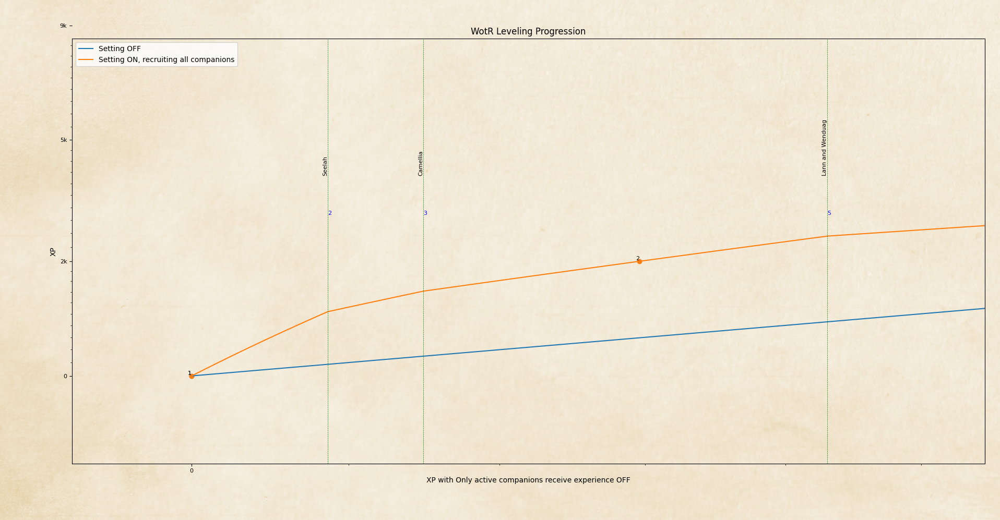

Two factors play part in this.

First, the graph plots 'boosted' XP vs 'setting OFF' XP, not vs time or in-game events. As a result, the spacing between events on the graph does not necessarily match progression during play. Between recruiting Camellia and meeting the Mongrels there are longer stretch with several minor encounters, followed by a brief period between meeting and recruiting the Mongrels. In XP terms, most of the gain occurs during that short interval.

Second, XP in the game is awarded in discrete chunks; some large, some small. Meeting the Mongrels grants a significant chunk that propels the player past level 2 instantly. The graph does not reflect these abrupt jumps, as its X-axis advances at a steady rate and is not tied to the timing or size of XP rewards in-game.

With that out of the way let us look at the practical effect of using the setting.

The largest advantage appears in the prologue, though a smaller one persists later in Act I. Reaching level 6 slightly earlier can be significant, as it coincides with a power spike for many classes. For instance, most full BAB martial class characters gain their first secondary attack at this point. To give some context, I marked the points where I encountered several hard Act I battles.

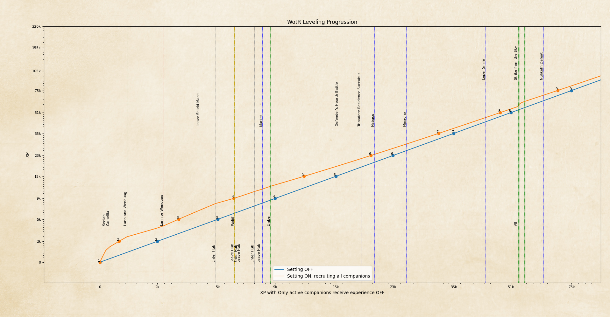

So here it still would have mattered for the Nabasu fight.

### Adjusting Recruitment Order

We can gain a little more mileage from the “Only active companions receive experience” setting by delaying the recruitment of Woljif and Ember. Doing so changes the sequence of events, but the existing data can still be used to approximate the effect.

Let us assume that Woljif and Ember are recruited after Daeran. By removing Woljif’s companion quest location (CQL), merging the adjacent hub intervals, and adjusting the XP of points between Woljif’s original recruitment point and Daeran’s, we can construct the revised progression graph.

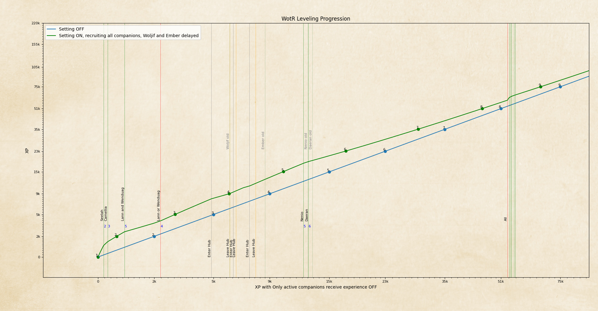

Overlaying both the adjusted and standard versions:

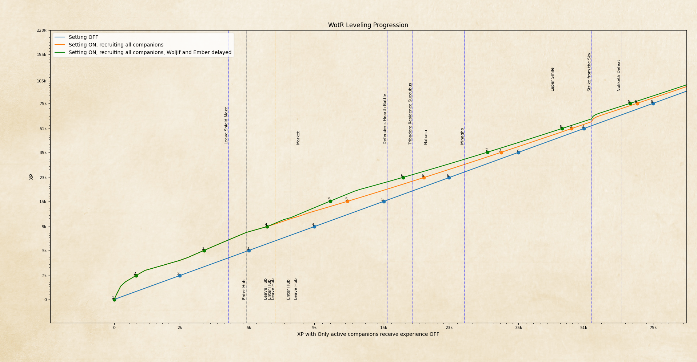

Further adjustments would be required if we wanted to reach level 6 before the Defender’s Heart fight or level 8 before the Vescavor Queen battle; both significant thresholds.

### Solo run

To begin, let us look at a solo progression graph without accounting for CQL or hub interruptions to boosted XP.

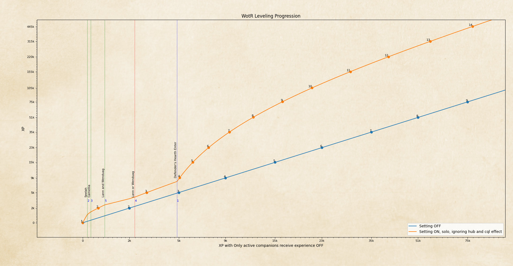

Now we apply CQL reductions; XP during these is gained as a party of two members instead of solo.

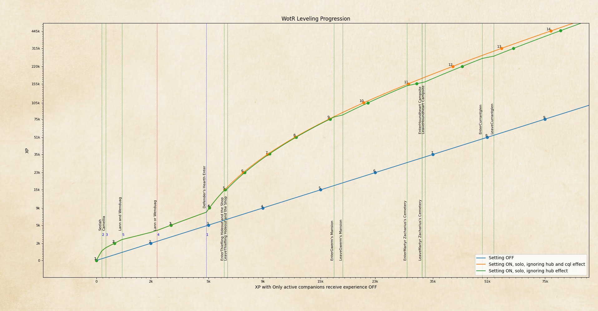

The effect is minor.

Including both hub and CQL interruptions, however, has a slightly more noticeable impact.

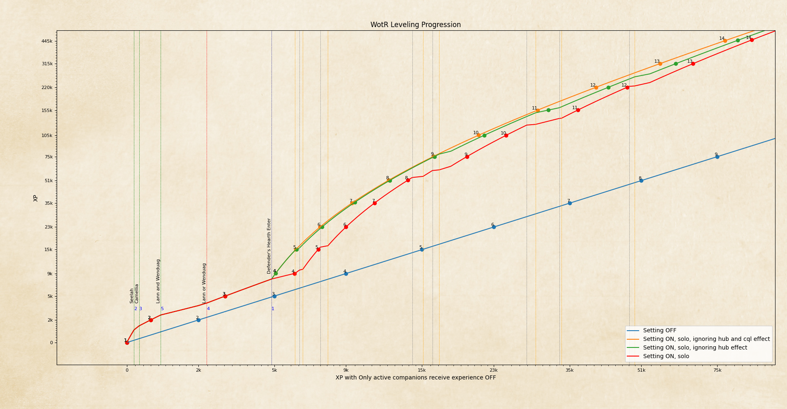

Even so, the difference remains smaller than feared. In hindsight, recording only the Prologue values would likely have sufficed for a rough approximation. 

Furthermore we ignore early precision, a simple six-times XP multiplier from level 3 onwards approximates the outcome quite closely past the Prologue. That level, though, we only could determine by recording those in-game Prologue values in the first place.

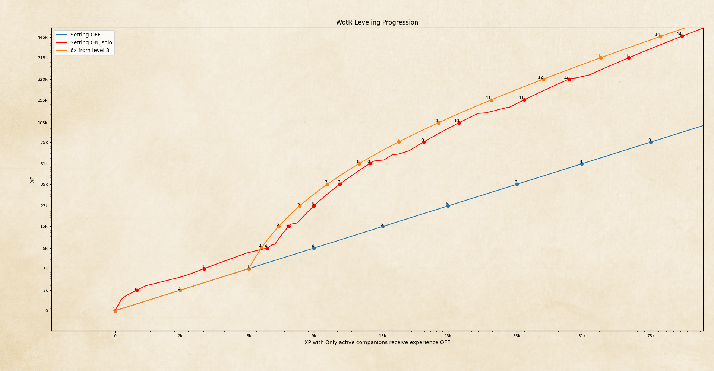

It is also possible to gain slightly more XP early on by killing off companions as soon as it becomes allowed in the Prologue.

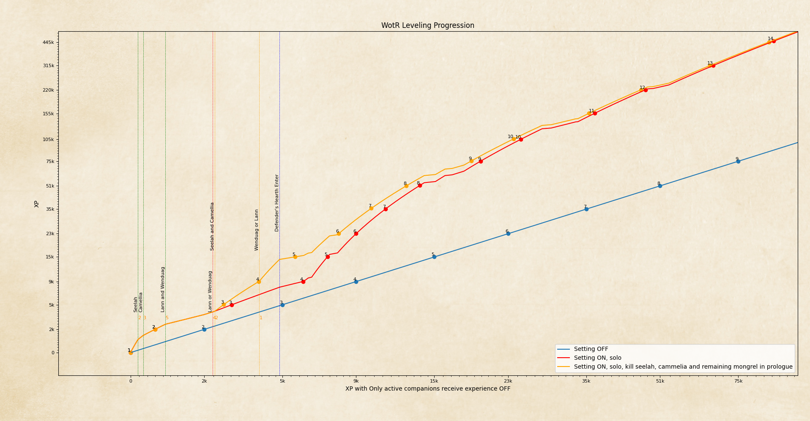

Below is a comparison between this variant, the standard solo progression, and the adjusted full-party run.

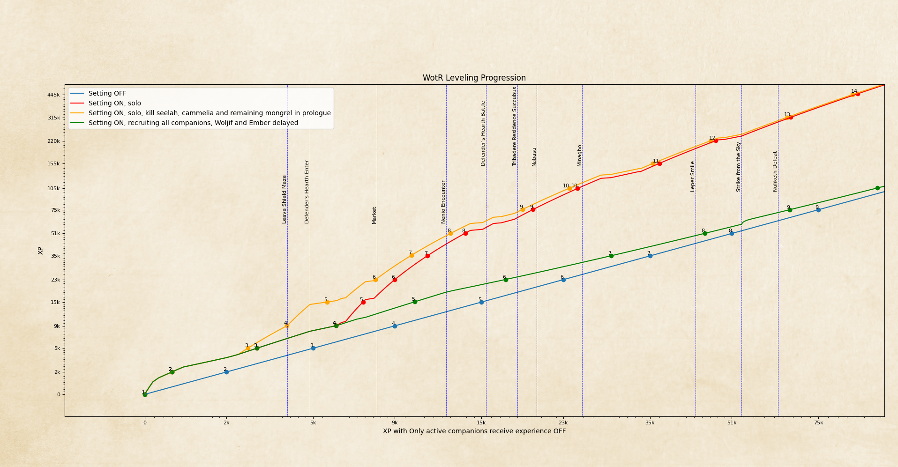

An assumption is being made that we **resurrect the companions** for their quests. This has a cost; raise dead scrolls are 6000 gold a piece. 

Since companions are automatically revived after completing the Shield Maze, one can try a variant where you only duo the Maze with a Mongrel and then continue as a four-person party up to Defender’s Heart, where you go solo.

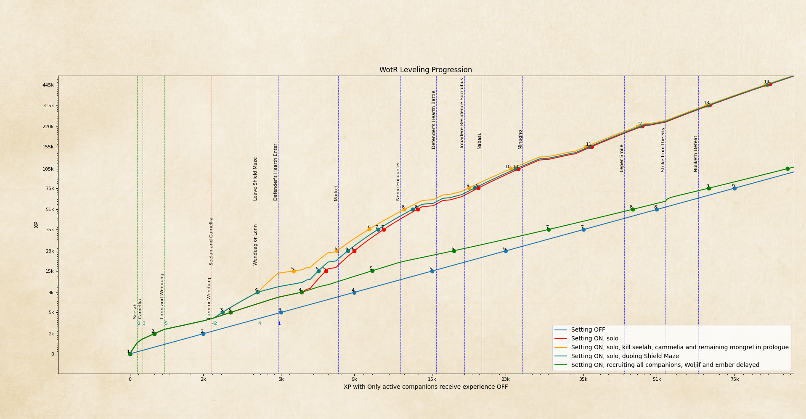

Whether that’s worth the added difficulty in the Shield Maze is very debatable. 

### Returning to a Full Party

The standard strategy involves gradually regaining companions after Strike from the Sky.

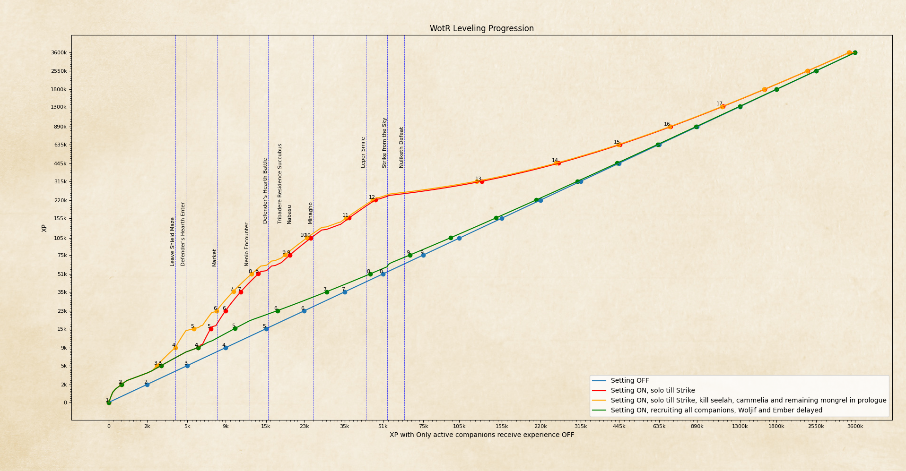

For my Forester run, I am considering an alternative approach: delaying the recruitment of Daeran, Ulbrig, and Ember until immediately before the Gray Garrison assault; the latest possible point. While the additional power is unnecessary for the Garrison itself, the character is otherwise underpowered during early Act II.

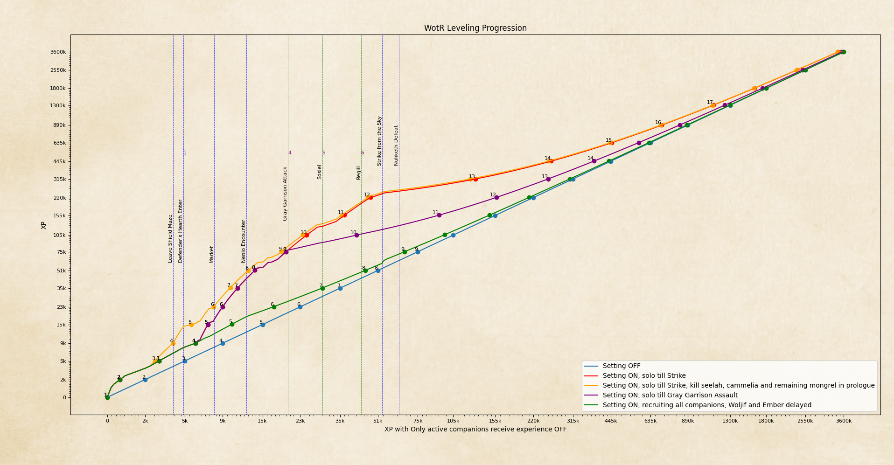

Under this approach, we move from roughly four levels ahead of the curve at Lost Chapel (Strike from the Sky) to about two levels ahead. In exchange, we can do Leper’s Smile with a full party two levels ahead of the baseline, rather than solo and three levels ahead. 

I'd take this trade even without the smoother start it provides in Act II.

Another variant where we recruit in the Act II companions; Sosiel and Regill, and then have Lann rejoin after the Vescavor Queen fight.

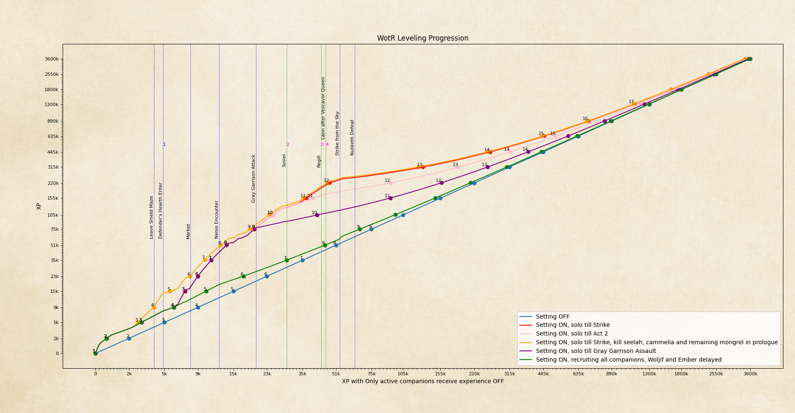

### Some more graphs

If you’re unable to solo the Market Square and Nenio encounters, there are other options besides the standard full-party run. For example, you can kill off companions during the Prologue and then still recruit new Act 1 companions, at higher XP, to help you trough those encounters. 

However, you'd need to duo the Shield Maze and then solo the post-Prologue Gray Garrison (at least that one fight where Irabeth and your party are split). In practice, that means using a build capable of soloing early Act 1 anyway. A more realistic variation might thus be a two-person setup; featuring a character that's strong early, yet can't function without a tank. 

There's is also the issue of the dead companions' companion quests. If you  want to access them, you would have to **resurrect the Prologue companions**. 

Below, I show what the difference looks like if you don’t, by zeroing out the XP for these two quests.

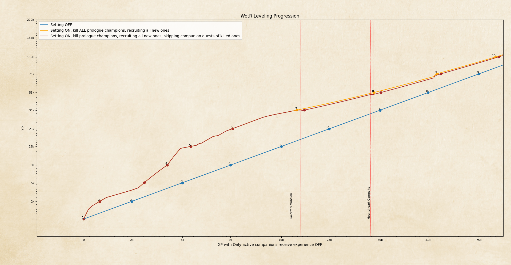

The difference is minimal. In the following graphs I did not zero out the quests for simplicity.

It’s also possible to simply leave the prologue group behind (no murder), but the XP gain from doing so is minimal compared to a standard run that delays Woljif and Ember’s recruitment, and so the loss of flexibility isn’t worth it.

Below I compare the delayed standard run with 3 variants of the above:

- Leaving the Prologue group behind (no murder)
- Killing all Prologue companions during the Prologue, this would mean duoing the Shield Maze and soloing the Gray Garrison
- Killing only Seelah and Camellia during the Prologue, this would mean duoing both. We leave or exchange Lann for Woljif at defender's hearth (meaning I didn't adjust rest of the data points out of laziness).

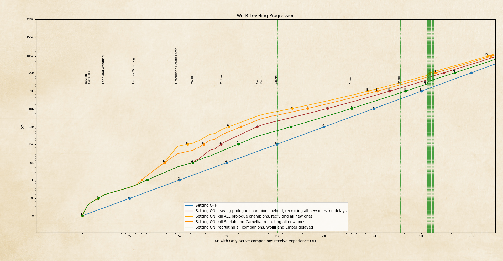

Same graph with events.

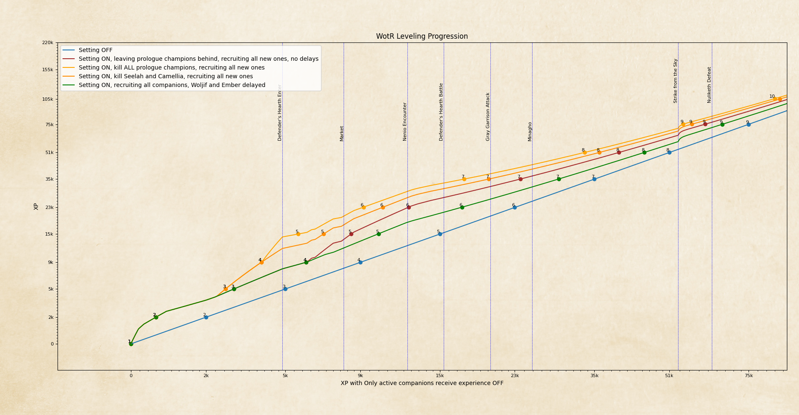

There are many other possible variations. For example, you could follow option three but kill Lann after the upstairs fight, or run a two-person party through the whole of Act I.

However, I can't cover all permutations; I have to draw the line somewhere. 

So I’ll end it now with a final graph that includes a selected subset of the variants already discussed.

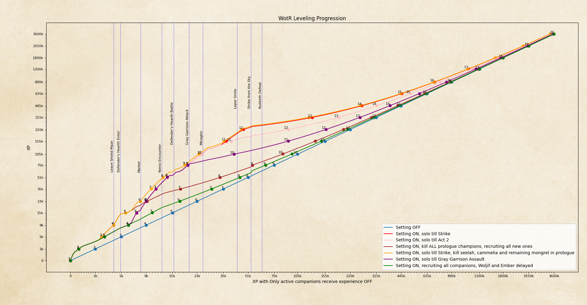

### Links

Video versions of both guides: [Shared Experience](https://youtu.be/T-W8uqmVQHg) and [Shard Experience: Addendum](https://youtu.be/iWK71YNBFvg).

[Steam Guide](https://steamcommunity.com/sharedfiles/filedetails/?id=3583533921), merging both the original and the addendum. I didn’t want to use my personal Steam account for it, so I created a new one and picked up the base game during a sale last summer. I’ll upload written versions of the earlier videos there as well, along with future ones.